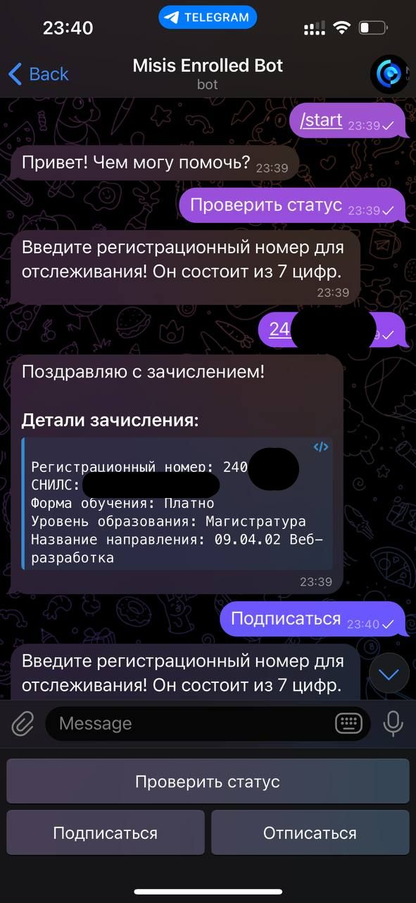

# НИТУ "МИСИС" Checker Telegram Bot

## Описание

Этот телеграм-бот позволяет абитуриентам НИТУ "МИСИС" проверять, зачислены ли они на выбранную программу. Кроме того, пользователи могут подписаться на уведомления, чтобы получить сообщение, как только их зачислят.



## Ссылка на Телеграм Бота

[Перейти к боту](https://t.me/misis_enrolled_bot)

## Функционал

- **Проверка зачисления**: Введите свою информацию, чтобы проверить, зачислены ли вы.
- **Подписка на уведомления**: Подпишитесь, чтобы получать уведомления о зачислении.

## Пример работы
<details>
  <summary>Пример работы
  </summary>

  

</details>


## Установка и запуск
Необходимо в секреты добавить токен от телеграм бота
```bash
dotnet user-secrets set "Telegram:Token" "YOUR_TOKEN"
```
Запуск можно произвести через Dockerfile:
```bash
docker build -t misis-tg -f ./misis-tg/Dockerfile .
docker run -d -u root --name misis-tg -e "TZ=Europe/Moscow" -p 7878:8080 -v ~/.microsoft/usersecrets/4bb1be19-6baf-40ce-9bf9-784d4afcf59a/:/root/.microsoft/usersecrets/4bb1be19-6baf-40ce-9bf9-784d4afcf59a/:ro  --restart=always misis-tg
```

### Требования

- .NET8

